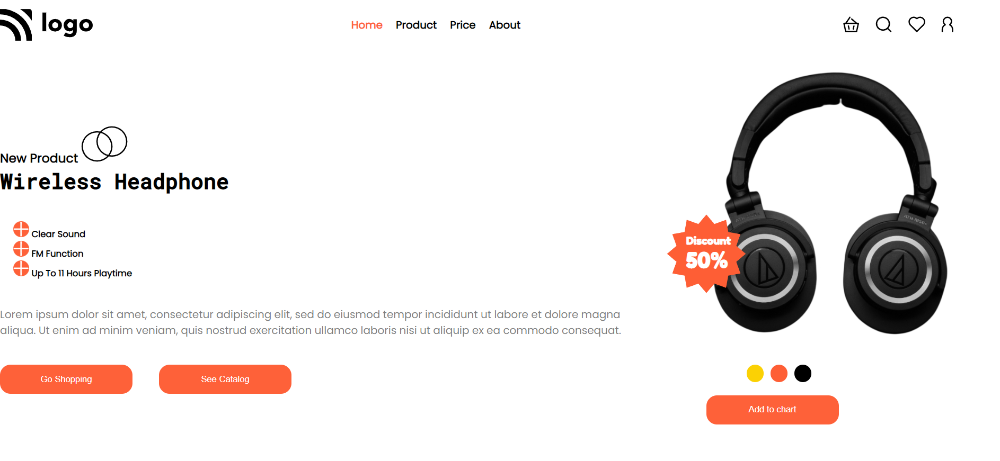
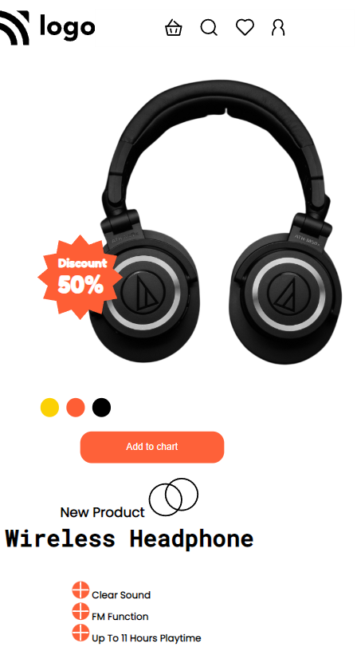

# project-07 #
[project-live](https://fswd-project7.netlify.app)
   - - - -
 # Technology used in this project #
    

   - - - - 
* Skill Gained in this project
  * Learned to make website responsive for multiple screen using __Media Queries__
  * Learn to used change direction of content in row or colum using 
  ___flex-direction___
  *  Leaned to  change the position using __realtive,absolute, etc__
  * Learned to create button using __padding__  and __border radius__
  
   - - - -
 ## Time taken to complete this project ##
 * 5 to 6 hrs  to completed this poject
 
 ## Screenshot ##
 
 

  - - -
   
